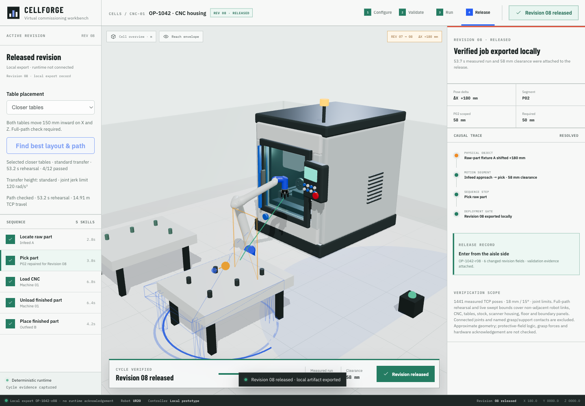

# CellForge

**Choose a cell scenario, run one CNC part, and inspect the engineering evidence behind the result.**

CellForge is a React, TypeScript and Three.js simulation workbench built by
Chet Paslawski. It connects an interactive 3D cell to deterministic process
state, robot kinematics, layout/path comparison and revision-bound exports.
It is a working software prototype; it does not control physical equipment.

**[Open the live CellForge demo](https://cellforge-orcin.vercel.app)**



© 2023 Universal Robots A/S. Use hereof is subject to Universal Robots A/S’
Terms and Conditions for Use of Graphical Documentation.

## Try the workflow

Open the [hosted demo](https://cellforge-orcin.vercel.app), or run it locally.
Local development requires Node.js 22.12+ and npm. No API keys, hosted model
or backend are required.

```bash
npm ci
npm run dev
```

1. Leave **Normal run** selected and click **Run cell**. Watch the UR20 pick
   stock, load the CNC, machine the part, unload it and return home.
2. Use **Pause**, **Resume** and **Reset** to inspect the live sequence. A
   successful cycle still requires all 1,441 ordered measured poses.
3. Choose **Moved fixture** to load a +180 mm infeed change. Its 9 mm P02
   clearance fails the 50 mm requirement; **Find working layout** runs the
   bounded recovery search and applies a passing candidate.
4. Choose **Blocked layout** and run it to see full-path rehearsal reject the
   reference setup for approximate self-contact near measured pose 1147.
5. Expand **Technical details** for commissioning evidence and local export.
   Exported JSON remains revision-bound and reports
   `runtimeAcknowledged: false`.

Measured simulation runs take longer than the nominal 24-second sequence.
Changing the layout or path invalidates previous run evidence.

## What is implemented

- React/TypeScript configuration, findings, repair comparison and release UI.
- Three.js scene through React Three Fiber/Drei; licensed UR20 URDF assets,
  custom three-jaw gripper and project-authored CNC machine.
- Damped-least-squares inverse kinematics with tool-position/direction targets.
- Full-path rehearsal against cloned loaded geometry before live animation.
- Bounded layout/path search with complete-candidate ranking and cancellation.
- Joint velocity, acceleration and jerk monitoring; measured pose acceptance.
- Approximate swept bounds for non-adjacent robot links, CNC, tables, stock,
  scanner housing, floor and boundary panels, with named contact exclusions.
- Interlocked process sequencing, simulated payload transfers, pause/resume,
  failed-run blocking and revision-matched JSON export.

## Architecture

```text
Cell configuration + typed job state
    → bounded candidate search → full-path rehearsal
    → selected motion plan → rendered URDF telemetry
    → ordered pose / contact / continuity acceptance
    → revision-bound evidence → local job export
```

Process state and validation live outside the scene graph. The renderer
consumes planned targets; the release gate consumes measured evidence.

Start with [`src/App.tsx`](src/App.tsx), [`src/layoutSearch.ts`](src/layoutSearch.ts),
[`src/pathPlanning.ts`](src/pathPlanning.ts),
[`src/cycleAcceptance.ts`](src/cycleAcceptance.ts) and
[`src/cncContact.ts`](src/cncContact.ts).

## Verification

```bash
npm run check
```

Runs TypeScript, 82 automated tests and the production build. Tests cover
collision bounds, motion continuity, incomplete/stale evidence and related
failure conditions. Browser evidence and reproducible scripts are documented
in [self/cell collision verification](docs/self-cell-collision-verification.md).
Historical measured results are dated there; they are not hardware benchmarks.
See [release review](docs/public-release-review.md) for the current audit.

## Scope

This is an engineering/product prototype, **not a certified simulator or
industrial safety system**. Collision bounds are approximate, not exact
continuous triangle collision. Connected-link/internal-gripper and named
support/grasp contacts have exclusions. Protective-field logic, grasp physics,
obstacle-obstacle layout collisions, calibration, PLC/robot-driver integration
and hardware acknowledgement are not implemented. Search covers a small
explicit candidate family, not general or globally optimal planning.

## Licence and assets

Original CellForge application code and project-authored assets are under the
[MIT licence](LICENSE). Third-party assets retain their own terms, including
restricted Universal Robots graphical-documentation terms. The entire asset
bundle is **not** MIT licensed. See [third-party notices](THIRD_PARTY_NOTICES.md)
and the pinned provenance files before redistribution.

## Contributing

See [CONTRIBUTING.md](CONTRIBUTING.md). Improvements to collision-aware
configuration selection, candidate coverage and testable runtime boundaries
are welcome. Keep safety and hardware limitations explicit.
