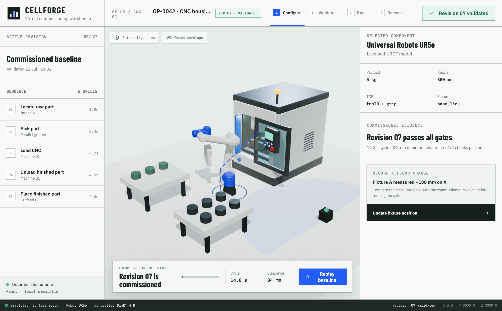

# CellForge

An interactive virtual-commissioning workbench for high-mix robotic machine tending.



CellForge is a browser-based workbench for designing and validating robotic machine-tending cycles before deployment. It brings cell configuration, motion planning, safety checks, process sequencing, and runtime artifacts into one workflow.

Before a workcell reaches the shop floor, an integrator should be able to verify that every target is reachable, motion stays within approved boundaries, machine interlocks are satisfied, and layout changes cannot produce an unsafe run.

## The 60-second demo

1. Open the validated Revision 07 machine-tending job and replay its 24-second baseline cycle.
2. Record a measured `+180 mm` change to the infeed-fixture position and create the Revision 08 draft.
3. Trace the resulting 9 mm clearance failure from the fixture to path P02, the pick step, and the release gate.
4. Compare two constraint-derived repairs, preview their paths and tradeoffs, then apply one to the draft.
5. Run the repaired cycle, capture validation evidence, and release the versioned Revision 08 runtime artifact.

The workflow follows the same path as a commissioning task: configure → validate → disturb → diagnose → deploy.

## Current vertical slice

- React + TypeScript product shell with a responsive, keyboard-accessible control surface
- Three.js scene rendered through React Three Fiber
- Licensed full-scale UR20 URDF joint hierarchy with official visual and collision geometry, a twisting three-jaw centric gripper for round stock, and a CellForge-authored VMC GLB with a functional door, visible spindle, table, vise, controls, and interior
- Target-driven machine-tending state machine with duration-weighted sequence stages
- Target-driven damped-least-squares IK on the actual URDF joint chain, with TCP position and tool-direction tracking at every machine-tending waypoint
- Hard motion gate for joint limits, floor height, reach, and the CNC solid volume/door aperture
- Real payload transfer: fixture → gripper → CNC → gripper → outfeed
- Interlocked CNC door, machine handshake, gripper state, and unsafe-run blocking
- Revision-aware fixture changes with before/after ghost geometry and spatial delta evidence
- Linked causal trace across physical object, motion segment, sequence step, and release gate
- Exact segment-to-AABB clearance for P02 using the fixture guide-rail keep-out and swept tool envelope
- Two deterministic repair candidates with distinct paths, computed clearance, and cycle-time tradeoffs
- Repair preview, validation gating, full-cycle evidence, and Revision 08 release workflow
- Component selection with domain-specific configuration data
- Reach-envelope and planned-path overlays
- Versioned JSON job-artifact export
- Reduced-motion support and a mobile layout

## Architecture

```text
Job intent + cell config
          │
          ▼
  React product state ──────► Preflight rules ──────► Deploy gate
          │                         │                       │
          ▼                         ▼                       ▼
 Three.js digital twin      Findings + metrics      cellforge.job/v1
          │
          ▼
 Simulated runtime clock ───► Sequence + machine + robot state
```

The deterministic process state and kinematics live outside the scene graph. Three.js consumes validated targets and limits animation-specific transforms to `useFrame` callbacks, keeping process behavior independent from rendering. The UR20 and VMC assets load behind in-canvas Suspense and an external error boundary. Robot licensing and pinned sources are recorded in [`public/robots/ur20/PROVENANCE.md`](public/robots/ur20/PROVENANCE.md); the project-authored machine source, node contract, and rebuild command are recorded in [`public/machines/cellforge-vmc/PROVENANCE.md`](public/machines/cellforge-vmc/PROVENANCE.md).

## Scope and limitations

The current robot and checks are a product prototype, not a certified engineering simulator:

- The visible robot uses the licensed, full-scale UR20 URDF hierarchy and official visual meshes with an off-frame IK planner and bounded joint-velocity/acceleration follower. Runtime TCP tracking is prototype evidence only; physical calibration, controller-specific planning, and hardware acceptance are not implemented.
- The deploy gate still uses the deterministic analytic reachability model rather than replaying the URDF solve across every sampled path state.
- The CellForge-authored VMC is a visual and interaction asset aligned to the existing Machine 01 envelope; it is not manufacturer CAD, a certified collision body, or a machining-process model.
- P02 clearance is geometry-derived from one axis-aligned fixture keep-out and a spherical tool envelope; it does not yet cover the full robot body or arbitrary mesh collisions.
- The “planner” sequence is seeded data; no hosted LLM is represented as running.
- Runtime synchronization is local and deterministic; there is no PLC or robot-driver connection.

## Roadmap

### 1. Real geometry and kinematics

The licensed UR20 asset, browser loader, six-joint hierarchy, limits, provenance, off-frame target solve, and bounded joint follower are integrated. Next, feed sampled actual-chain TCP acceptance into the deploy gate.

### 2. Computed commissioning checks

Use Three.js bounds and a BVH-accelerated collision layer for swept-volume clearance, unreachable targets, joint-limit violations, and fixture collisions. Persist findings with scene-object references.

### 3. Product ↔ runtime bridge

Add a small Fastify/WebSocket service that executes a typed state machine, streams telemetry and faults, supports reconnect/replay, and validates `cellforge.job/v1` at the boundary.

### 4. Structured AI job authoring

Translate natural-language intent into a constrained skill graph, validate the generated schema, require human approval for ambiguous frames or devices, and keep deterministic simulation as the acceptance gate.

### 5. Verification and operations

Add unit tests for job validation, browser tests for the fault/recovery flow, a recorded demo, performance budgets, and an architecture note covering safety boundaries and failure modes.

## Run locally

```bash
npm install
npm run dev
```

Production verification:

```bash
npm run typecheck
npm test
npm run build
```

## Stack

- React 19
- TypeScript 5.9
- Three.js 0.185
- React Three Fiber + Drei
- Vite 8

## Engineering principles

- Unsafe configurations block execution rather than producing best-effort motion.
- Process state is explicit, deterministic, and testable outside the renderer.
- The same typed job model drives simulation, validation, and export.
- Physical assumptions and unsupported integrations remain visible at the product boundary.
- Visual feedback explains what the cell is doing, what failed, and what must change before deployment.
