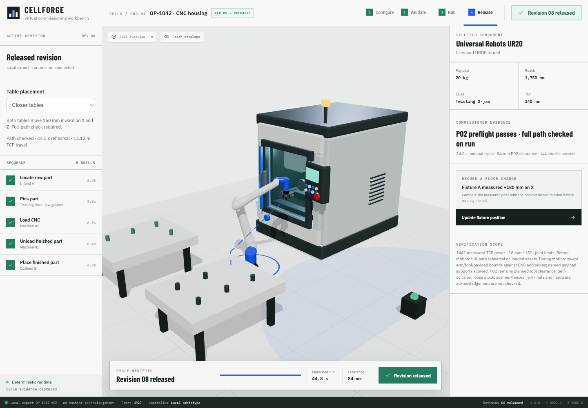

# Collision-aware layout candidate verification

This slice depends on open PR #13. It preserves that branch and the recovery checkpoint; it does not merge or deploy either. The reference table layout remains available unchanged. Select **Closer tables** to evaluate a layout with both tables 150 mm closer on X and 150 mm closer to the center aisle on Z.

## Shared model and execution gate

`src/cellLayout.ts` owns table origins, dimensions, legs, slot coordinates, and preset identities. Rendering, pick/place targets, the P02 fixture frame, runtime table bounds, and the benchmark consume those values. Outfeed approach and placement now follow the selected layout. The CNC frame remains fixed in this slice.

Run first rehearses the complete candidate using copies of the loaded robot, gripper, CNC, and table meshes. The live robot remains stationary. Rehearsal uses the same IK, joint velocity/acceleration limits, pose tolerances, ordered 1441 commands, gripper/door animation, and approximate swept OBB guard as execution. It checks every simulated frame at 60 Hz, with an eight-second tracking budget per command and settled home at the end. Missing geometry, unreachable poses, contact, joint boundary/continuity failure, or incomplete coverage prevents execution. The computation yields between batches and cancels when the revision changes.

The runtime guard remains a second, independent check and now includes table tops and legs. Only the carried payload may contact its designated table support slot from above within 6 mm vertical tolerance and 40 mm horizontal distance. This exclusion also requires the preceding frame to be above the support; it cannot excuse tunneling from underneath. All arm/gripper-to-table contact remains blocked. Loose table stock is excluded explicitly.

Every run resets the robot, door, spindle, and gripper. The live IK clone normalizes inherited position/rotation/scale before applying its wrapper coordinate conversion, fixing a double-rotation defect exposed by hot reload during acceptance.

Layout and motion version are included in the revision key. Changing layout, fixture shift, or repair clears rehearsal and execution evidence. Exports require both matching rehearsal evidence and a completed measured run; they include layout, outfeed target, planning coverage and timing, actual cycle evidence, and `runtimeAcknowledged: false`. A layout change by itself is an R08 draft and can be exported after verification.

## Repeatable benchmark

Start the dev app with `npm run dev -- --host 127.0.0.1 --port 5173`, open it in Playwright CLI, then run `scripts/benchmark-layouts-browser.js` through `run-code`. The script uses geometry copies, evaluates both layouts with all three paths, and fails if any candidate does not accept all 1441 poses. `scripts/verify-planning-failures-browser.js` verifies missing geometry, obstructed CNC, obstructed table, unreachable target, and cancellation rejection. Both scripts require the dev app's geometry hook and do not mutate live assets.

Machine-readable results are in [layout-benchmark.json](layout-benchmark.json). These are fixed-rate rehearsals, not measured wall-clock runs or guaranteed cycle times.

| Layout | Path | Accepted poses | Rehearsal | TCP travel | P02 clearance |
| --- | --- | ---: | ---: | ---: | ---: |
| Reference | Baseline | 1441 | 49.78 s | 14.61 m | 84 mm |
| Reference | Lifted approach | 1441 | 48.30 s | 14.13 m | 84 mm |
| Reference | Side entry | 1441 | 48.43 s | 14.17 m | 58 mm |
| Closer | Baseline | 1441 | 44.45 s | 13.12 m | 84 mm |
| Closer | Lifted approach | 1441 | 44.07 s | 13.00 m | 84 mm |
| Closer | Side entry | 1441 | 44.02 s | 12.97 m | 58 mm |

All six candidates had no contact/continuity failure; maximum measured joint acceleration was 4.00 rad/s². The closer baseline reduced rehearsal time by 10.7% and TCP travel by 10.2%, without sacrificing the existing P02 clearance. This is a verified candidate improvement, not a global optimum.

## Browser acceptance

- Reference baseline completed 1441 measured poses in 49.83 s. Pause held joints, progress, and door position unchanged; resume completed.
- Closer baseline completed 1441 measured poses in 44.77 s, approximately 10.2% faster. Rendered stock changed from six to five raw parts and three to four finished parts. Its downloaded artifact passed layout/revision-key/coverage/outfeed-target/acknowledgement checks.
- Closer lifted-approach and side-entry repairs each completed 1441 measured poses, in 44.48 s and 44.25 s respectively, with no contact or continuity failure.
- Enlarging the loaded DoorGlass before Run blocked at sample 0 without moving any live joint. Release blocked produced no download. Restoring geometry allowed a fresh successful run.
- Updating the fixture while planning cancelled the old candidate. After waiting, no execution started; P02 remained blocked until a repair was applied.
- A 390 px viewport had a 390 px document scroll width. No browser console errors; existing asset-loader/deprecation warnings remain.
- `npm run check`: TypeScript, 61 tests, and production build passed. New tests cover frame-derived slots, repair clearance in both layouts, unreachable layouts, missing assets, table tunneling, and support exclusions. The existing large scene-chunk warning remains.

Raw browser evidence and downloaded artifacts are retained in `output/playwright/` and copied to the durable artifact directory named in `NOW.md` before publishing.

## Limits and next slice

This is bounded candidate validation before motion, not an automatic general-purpose path-search planner. It retains the existing approximate endpoint-enclosing swept boxes with 2 mm padding; it is not exact continuous collision detection or certified safety evidence. It does not check robot self-collision, loose table stock, scanner/fences, grasp forces, or hardware acknowledgement. Joint jerk is not bounded. P02 is still a separate planned tool-envelope clearance calculation. A fixed-rate rehearsal cannot certify all variable-frame execution, hence runtime contact and continuity checks remain mandatory. Nominal 24 s is not presented as achieved execution time.

Next: search a bounded family of layouts/waypoints automatically, add jerk-limited trajectory timing and self/remaining-cell collision bodies, and retain the same candidate rejection, live acceptance, and export gates.
