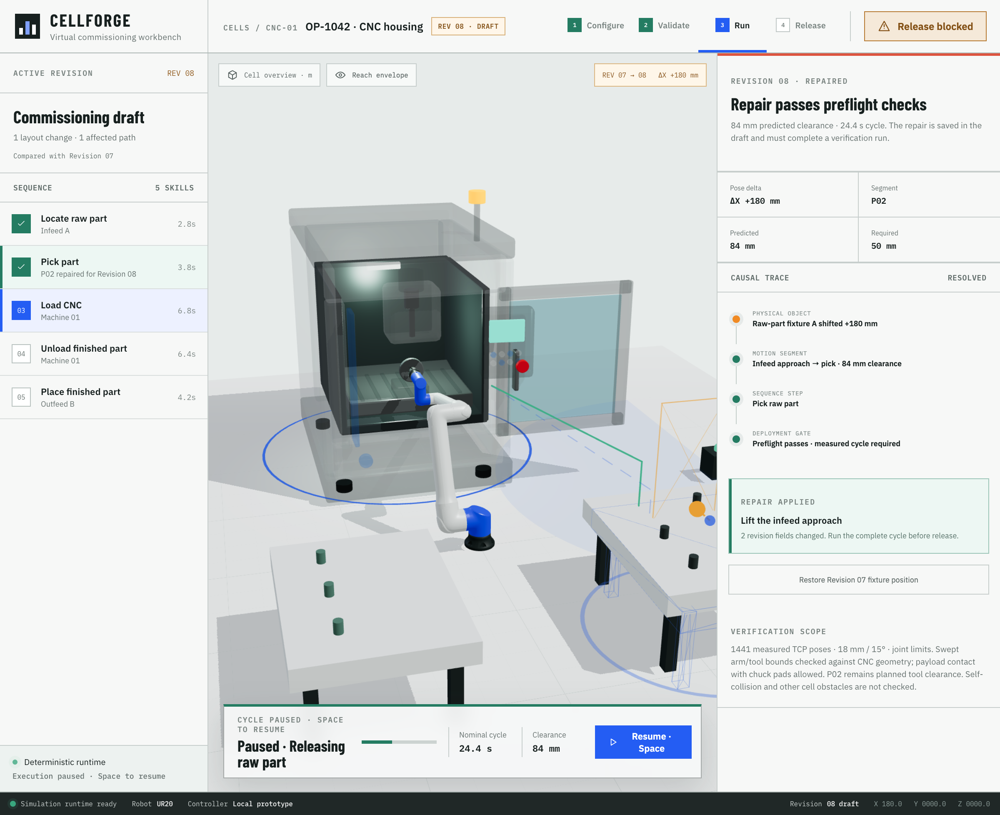

# Motion and CNC contact verification

## Change and scope

The prior cycle accepted 241 endpoint poses and the planned P02 tool envelope. It did not check rendered arm/CNC contact. Browser reproduction showed the opened door still covering the entry corridor. The original horizontal blank also overlapped a front vise jaw and a lowered cutting tool.

This slice uses 1441 ordered pose commands, a tighter IK solve, continuous velocity through command crossings, and acceleration-limited joint integration with elapsed-time substeps. It retains the previous IK solution instead of reseeding every outfeed command. Final home must settle below 0.01 rad/s before completion; completed runs freeze. A new run resets the simulation pose, while pause/resume preserves it.

The CNC door travels 1.3 m and closes after withdrawal. The arm aligns outside the door before a straight axial entry/withdrawal. A horizontal receiving chuck exposes the front of the 80 mm blank to the gripper; its pads grip the rear 7 mm, and the backplate sits 10 mm behind the blank. The spindle retracts for loading/unloading.

Every rendered motion frame checks oriented bounding boxes from the loaded arm, gripper, carried blank, and CNC meshes. Endpoint boxes are enclosed to approximate the swept volume, with 2 mm padding for small curved excursions. Contact latches a failure for that run. Transparency does not disable checks. Only the carried blank's intentional contact with the named chuck pads is excluded; robot/chuck and payload/backplate collisions remain checked.

A separate monitor derives joint speed and acceleration from actual joint changes, with an acceleration acceptance ceiling of 4.1 rad/s² (the controller commands at most 4). Contact and continuity failures block cycle acceptance and export. The revision key includes the new motion contract, and exported evidence includes the per-sample checks and measured motion maxima.

## Verification

- Regression coverage includes crossing thin glass between clear endpoints, moving-door contact, transparent cutaways, withdrawing without a false backward collision, contact exclusions, missing geometry, uneven frame times, target reversals, pause state, failure latching, final settling, and chuck/blank geometry.
- `scripts/verify-cnc-sweep-browser.js` replays copies of the rendered assets, including jaw and door animation, across baseline and both repair plans. Its fixed-rate sweep complements live browser verification; it does not replace it.
- `npm run check` passes: TypeScript, 51 tests, and the production build. The existing large scene-chunk warning and asset-loader warnings remain; browser verification logged no console errors.
- A stopped loading pose and alternate camera/cutaway view were inspected. Pause held the measured joints, progress, and door position unchanged; resume completed correctly. The 390 px release page had a 390 px scroll width.
- Enlarging the rendered DoorGlass into the arm stopped the run after two accepted samples. Clicking Release blocked emitted no download. Restoring the geometry and retrying reset the simulation and started fresh evidence.
- Both repaired artifacts are downloaded and checked for their repair-specific revision key, every ordered sample, no contact/continuity failure, settled home, and `runtimeAcknowledged: false`.

| Rendered workflow | Accepted poses | Measured duration | Swept checks | Peak joint acceleration |
| --- | ---: | ---: | ---: | ---: |
| Baseline | 1441 | 49.91 s | 2992 | 4.00 rad/s² |
| Lifted approach (pause excluded) | 1441 | 48.55 s | 2913 | 4.00 rad/s² |
| Side entry (after injected-contact retry) | 1441 | 48.81 s | 2928 | 4.00 rad/s² |

The controller adjustment reduced baseline execution from 59.48 s to 49.91 s with the same limits. It is still slower than the prior endpoint-only baseline (37.19 s). This tradeoff is explicit in the measured run display and export; nominal 24 s is not reported as achieved.

Screenshots, baseline evidence, and repair exports are retained in `output/playwright/` (ignored by Git). The loading cutaway above is committed for review.

## Limits and next milestone

This is an approximate bounding-volume contact guard, not exact continuous triangle collision detection or a safety certificate. It can conservatively reject close poses. It covers the CNC meshes and carried payload; robot self-collision, other cell obstacles, contact forces, grasp stability, and hardware acknowledgements remain outside scope. P02 evidence remains the planned tool envelope. Nominal cycle time is a planning reference; measured execution duration is exported separately.

The next milestone is a collision-aware trajectory planner that validates the full path before execution, respects velocity/acceleration/jerk limits, and uses the runtime contact guard as a second check. Vision remains useful for checking model fidelity and interpreting unexpected behavior.
